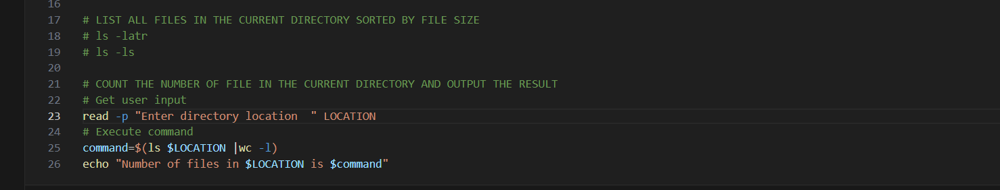

# AUX-PROJECT-1-SHELL-SCRIPTING

#! /bin/bash

## ASK THE USER FOR THEIR NAME AND AGE AND OUTPUT A MESSAGE WITH THEIR NAME AND THE YEAR THEY WERE BORN

echo "What is your name?"
read name
echo "What is your year of birth"
read year of birth
echo "My name is $name and my year of bith is $year of birth"

[label](Images_Aux/Quest1.mkv)

## CREATE A NEW DIRECTORY WITH A NAME PROVIDED BY THE USER AND NAVIGATE INTO IT 
# mkdir Olanrewaju_sofela
# cd Olanrewaju_sofela

[label](Images_Aux/Quest2.mkv)

## LIST ALL FILES IN THE CURRENT DIRECTORY SORTED BY FILE SIZE 
# ls -latr
[label](Images_Aux/Quest3.mkv)# ls -ls

## COUNT THE NUMBER OF FILE IN THE CURRENT DIRECTORY AND OUTPUT THE RESULT 
# Get user input
read -p "Enter directory location  " LOCATION
## Execute command
command=$(ls $LOCATION |wc -l)
echo "Number of files in $LOCATION is $command"

[label](Images_Aux/Quest4.mkv)

## TAKE A LIST OF NUMBERS AS INPUT FROM THE USER AND OUTPUT THE SUM OF THOSE NUMBERS 
declare -a arrSum
read -p "Enter numbers: " arrSum
for i in ${arrSum[@]}
do 
   if [$i -ge 0 ]
   then 
         ((tot=$tot + $i))
    fi 
    ((c=$c+1))
done 
echo "Total is: $tot"
echo "The number of items: $c"

## OUTPUT A RANDOM NUMBER BETWEEN 1 AND 100 

num1=$(( $RANDOM % 100))
echo "$num1"

[label](Images_Aux/Ques6.mkv)